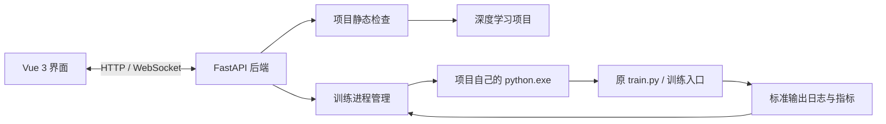

# 深度学习训练管理器

一个在 Windows 本地运行的深度学习项目训练管理工具。它基于 **FastAPI + Vue 3** 构建为桌面应用，用于检查深度学习项目、配置训练参数、启动或停止训练、查看实时日志，并绘制 Loss / Accuracy 等训练指标。

它不会替代你的模型训练代码。训练仍由项目本身的 `train.py`（或其他训练入口）以及项目自己的 Python 环境执行；本软件负责提供统一的管理界面和调度能力。

## 功能概览

- 选择本地深度学习项目文件夹并进行静态检查
- 识别常见训练入口：`train.py`、`main.py`、`run.py`、`trainer.py`
- 使用 Python AST 识别常见的 `argparse.add_argument(...)` 参数
- 识别 JSON / YAML 配置、常见训练参数和 PyTorch、TensorFlow、Lightning、Transformers、Ultralytics 等框架线索
- 项目无适配文件时提供两种接入方式：**自动配置** 或 **手动配置**
- 自动配置前预览将生成的文件，并且不会修改原始训练源码
- 使用项目自己的 `python.exe` 启动独立训练进程
- 启动前检查训练入口、Python 解释器、框架依赖和常见数据集路径
- 实时显示 UTF-8、GBK / GB18030 中文训练日志，并兼容 `tqdm` 进度条
- 解析常见 `loss`、`accuracy`、学习率等日志指标并绘制曲线
- 保存项目、实验、训练任务、日志和指标历史
- 提供安全停止训练和运行时控制文件协议

## 技术架构



桌面版通过 `pywebview` / WebView2 显示 Vue 页面；FastAPI 服务运行在随机本地端口，不会把训练代码或数据上传到网络。

## 快速开始

### 方式一：直接运行桌面版

双击项目根目录中的：

```text
DeepLearningManager.exe
```

首次运行需要 Windows WebView2 Runtime。Windows 10 / 11 通常已内置；若窗口无法显示，请安装 [Microsoft Edge WebView2 Runtime](https://developer.microsoft.com/microsoft-edge/webview2/)。

### 方式二：从源码运行

环境要求：

- Windows 10 / 11（64 位）
- Python 3.10 或更高版本
- Node.js 18 或更高版本

第一次安装依赖：

```powershell
.\setup.bat
```

启动开发版本：

```powershell
.\start.bat
```

打包桌面 EXE：

```powershell
.\build-desktop.bat
```

生成文件位于：

```text
dist\DeepLearningManager.exe
```

## 使用流程

1. 打开软件，点击“选择文件夹”，选择你的深度学习项目根目录。
2. 软件只读取和静态分析项目文件，检查阶段不会执行训练，也不会修改项目源码。
3. 在检查结果中填写该项目自己的 Python 解释器，例如：

   ```text
   C:\projects\my-model\.venv\Scripts\python.exe
   ```

4. 若项目已有 `.dl-manager.json`，确认参数后直接注册项目。
5. 若没有适配文件，选择“自动配置”或“手动配置”。
6. 注册项目，填写训练参数，点击“启动训练”。
7. 在“任务中心”查看实时日志、训练状态和指标曲线。

> 解释器必须是目标深度学习项目真正使用的环境。即使系统 Python 可以运行，也不代表它已经安装了该项目所需的 PyTorch、TensorFlow、CUDA 等依赖。

## 项目接入方式

### 自动配置

当软件识别到训练入口使用了标准命令行参数时，例如：

```python
parser.add_argument("--epochs", type=int, default=30)
parser.add_argument("--batch-size", type=int, default=32)
parser.add_argument("--learning-rate", type=float, default=0.001)
```

检查后可选择“查看并自动配置”。软件会先展示预览，确认后仅在**目标项目根目录**新增以下三个文件：

```text
manager_train.py
dl_manager_config.json
.dl-manager.json
```

含义如下：

- `manager_train.py`：转发管理器参数到原训练入口。
- `dl_manager_config.json`：保存自动识别到的默认参数值。
- `.dl-manager.json`：告诉管理器训练入口、解释器和可调参数的明确描述。

自动配置不会覆盖已有的同名文件，也不会修改 `train.py`、`config.py`、数据集或模型代码。它适合参数已经通过 `argparse` 暴露出来的常规项目。

### 手动配置

如果项目使用复杂的配置类、动态导入、Hydra、第三方训练器，或没有标准命令行参数，建议手动创建 `.dl-manager.json`。下面是一个最小示例：

```json
{
  "version": 1,
  "framework": "PyTorch",
  "entrypoint": "train.py",
  "python": ".venv\\Scripts\\python.exe",
  "arguments": [],
  "metric_prefix": "@@METRIC@@",
  "parameters": [
    {
      "key": "epochs",
      "label": "训练轮数",
      "type": "integer",
      "default": 30,
      "minimum": 1,
      "flag": "--epochs"
    },
    {
      "key": "batch_size",
      "label": "Batch Size",
      "type": "integer",
      "default": 32,
      "minimum": 1,
      "flag": "--batch-size"
    },
    {
      "key": "learning_rate",
      "label": "学习率",
      "type": "number",
      "default": 0.001,
      "minimum": 0.000001,
      "flag": "--learning-rate",
      "runtime_editable": true
    }
  ]
}
```

`entrypoint` 是训练脚本相对于项目根目录的路径；`python` 应填写该项目环境的解释器路径或相对路径。

## 训练指标协议

软件会尝试从常见日志格式中提取指标，但最可靠的做法是在训练代码中输出结构化指标：

```python
import json

print("@@METRIC@@" + json.dumps({
    "epoch": epoch,
    "step": global_step,
    "train/loss": float(train_loss),
    "validation/accuracy": float(accuracy),
    "learning_rate": optimizer.param_groups[0]["lr"]
}), flush=True)
```

软件收到该行后会保存数值，并在训练页面更新曲线。若训练脚本不输出 loss / accuracy，图表没有数据可画，但训练仍可正常进行。

## 运行时控制协议

启动训练时，管理器会设置以下环境变量：

- `DL_MANAGER_RUN_DIR`：本次任务的独立输出目录
- `DL_MANAGER_CONTROL_FILE`：运行时控制文件路径

训练代码如果需要响应“停止训练”或“动态调整学习率”等指令，可定期读取控制文件：

```python
import json
import os
from pathlib import Path

control_path = Path(os.environ["DL_MANAGER_CONTROL_FILE"])
control = json.loads(control_path.read_text(encoding="utf-8"))

if control.get("stop_requested"):
    # 保存 checkpoint 后退出训练循环
    should_stop = True

if "learning_rate" in control:
    for group in optimizer.param_groups:
        group["lr"] = float(control["learning_rate"])
```

没有实现该协议的项目仍然能够启动、显示日志和被停止；只是无法在训练运行中动态应用学习率或 Epoch 等修改。

## 目录结构

```text
fastapi+vue/
├─ backend/                 # FastAPI 后端：检查、启动、日志、指标、SQLite
├─ frontend/                # Vue 3 前端：界面、参数表单、图表
├─ examples/                # 不依赖 PyTorch 的演示训练项目
├─ data/                    # 本机生成的数据库、任务日志与历史数据（不提交）
├─ desktop.py               # pywebview 桌面应用入口
├─ build-desktop.ps1        # PyInstaller 打包脚本
├─ requirements-desktop.txt # 桌面端打包依赖
└─ DeepLearningManager.exe  # 本机构建的桌面程序（不提交）
```

## 安全与限制

- 项目检查使用静态分析，不会导入或执行所选项目代码。
- 点击“启动训练”后，训练项目会以当前 Windows 用户权限运行；只应运行你信任的项目。
- 自动配置只覆盖标准命令行参数场景，不能保证所有深度学习项目一键适配。
- 对复杂项目，使用 `.dl-manager.json` 或独立桥接脚本比让软件猜测配置结构更可靠。
- 本项目设计为单机本地工具，不应直接暴露到公网。

